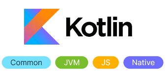

# Awesome KMP

  

### Here is a list of some awesome KMP projects you may want to check out:

[Pacemaker](https://github.com/sellmair/pacemaker) - App for monitoring a whole groups heart rate, notifying the whole group if one exceeds his personal limit

[Kable](https://github.com/JuulLabs/kable) - Kotlin Asynchronous Bluetooth Low-Energy

[SensorTag](https://github.com/JuulLabs/sensortag) - Sample demonstrating use of Kable library with SensorTag device

[MortyComposeKMM](https://github.com/joreilly/MortyComposeKMM) - GraphQL based Jetpack Compose and SwiftUI Kotlin Multiplatform project (using https://rickandmortyapi.com/graphql)

[BikeShare](https://github.com/joreilly/BikeShare) - SwiftUI, Jetpack Compose, and Compose for Desktop based Kotlin Multiplatform project (using CityBikes

[Fantasy Premier League](https://github.com/joreilly/FantasyPremierLeague) - Kotlin Multiplatform sample using Jetpack Compose and SwiftUI (and Realm for local persistence)

[StarWars](https://github.com/joreilly/StarWars) - Minimal GraphQL based Jetpack Compose, Wear Compose and SwiftUI Kotlin Multiplatform sample (using StarWars endpoint

[PeopleInSpace](https://github.com/joreilly/PeopleInSpace) - Kotlin Multiplatform project with SwiftUI, Jetpack Compose, Compose for Wear, Compose for Desktop, Compose for Web and Kotlin/JS + React clients along with Ktor backend

[Confetti](https://github.com/joreilly/Confetti) - KMP GraphQL based conference sample with Jetpack Compose Android, Compose for Wear and SwiftUI iOS clients along with GraphQL backend

[KMP-App-Template](https://github.com/Kotlin/KMP-App-Template) - Kotlin Multiplatform app template with shared UI

[Orbital](https://github.com/skydoves/Orbital) - Jetpack Compose Multiplatform library that allows you to implement dynamic transition animations such as shared element transitions

[KMPStarterOS](https://github.com/AppKickstarter/KMPStarterOS) - Open source template for Kotlin multiplatform and Compose Multiplatform

[DeckBox](https://github.com/r0adkll/DeckBox) - DeckBox for Pokémon

[FocusBloom](https://github.com/JoelKanyi/FocusBloom) - A Kotlin Multiplatform app that helps users enhance their productivity and time management skills through focused work intervals and short breaks

[KotlinConfGDGHelwan](https://github.com/qamarelsafadi/KotlinConfGDGHelwan) - KotlinConfGDGHelwan

[NotesAppKMM](https://github.com/kamathis4/NotesAppKMM) - Simple Notes App with KMM Compose, Koin, Decompose and Coroutines

[Image Viewer](https://github.com/JetBrains/compose-multiplatform/tree/master/examples/imageviewer) - An application for capturing, viewing, and storing pictures. Includes support for maps. Uses Compose Multiplatform for the UI. Introduced at KotlinConf 2023.

[NYTimes-KMP](https://github.com/xxfast/NYTimes-KMP) - A KMP template of the New York Times App using Compose multiplatform for Android, Desktop, iOS and Web

[DroidconKotlin](https://github.com/touchlab/DroidconKotlin) - Kotlin Multiplatfom app for Droidcon Events.

[Chat](https://github.com/JetBrains/compose-multiplatform/tree/master/examples/chat) - A demonstration of how to embed Compose Multiplatform components within a SwiftUI interface. The use case is online messaging.

[Tivi](https://github.com/chrisbanes/tivi) - Tivi is a TV show tracking Android app, which connects to trakt.tv.

[FocusBloom](https://github.com/JoelKanyi/FocusBloom) - A Kotlin Multiplatform app that helps users enhance their productivity and time management skills through focused work intervals and short breaks.

[RecipeApp](https://github.com/SEAbdulbasit/recipe-app) - Recipe App in Compose Multiplatform

[Kotlin Multiplatform Mobile Sample](https://github.com/Kotlin/kmm-basic-sample) - Example of Kotlin multiplatform project by Jetbrains

[KaMPKit](https://github.com/touchlab/KaMPKit) - KaMP Kit by Touchlab. A collection of code & tools designed to get your mobile team started quickly w/Kotlin Multiplatform - by TouchLab

[Bookshelf](https://github.com/realm/realm-kotlin-samples/tree/main/Bookshelf) - A demonstration of how to use the Realm database in a Kotlin Multiplatform application.

[D-KMP-sample](https://github.com/dbaroncelli/D-KMP-sample) - D-KMP Architecture official sample: it uses a shared KMP ViewModel and Navigation for Compose and SwiftUI apps.

[Notflix](https://github.com/VictorKabata/Notflix) - Kotlin Multiplatform playground